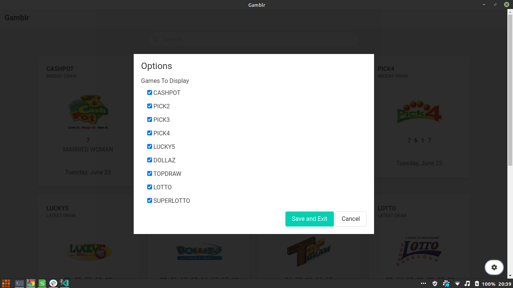

# Gamblr

A desktop application implementation of webscraping in golang. It utilizes a socket implementation to get 
real time results from the [Supreme Venture Website](https://supremeventures.com/).

## Run

Make sure go is installed then run the following command in the project directory. [Golang installation instruction can be found here](https://golang.org/doc/install)
```
 go run main.go
```

## Screenshot

### Main Screen


### Settings

